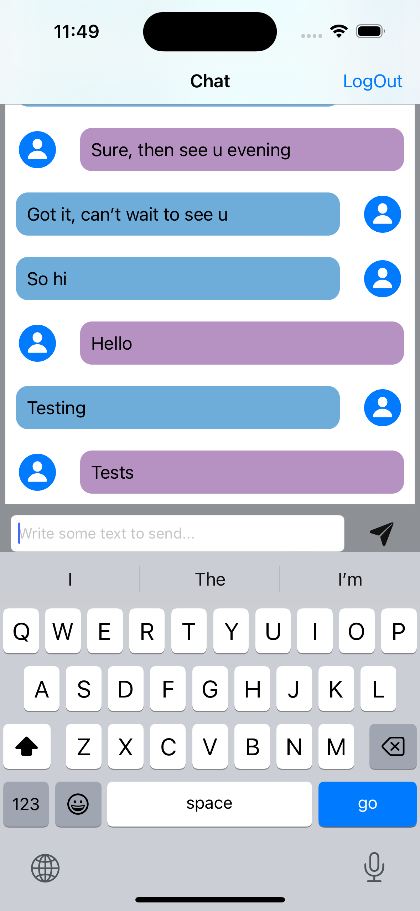

# UMeChat App for iOS
UMe chat is simple messaging application similar to WhatsApp. I used the service called Firebase Firestore as a backend, to store and retrieve messages.

## App screenshots

  
  

## What I Learned ?
- Integrate third party libraries in your app using Cocoapods and Swift Package Manager.
- Store data in the cloud using Firebase Firestore.
- Use Firebase for user authentication, registration and login.
- Work with UITableViews and how to set their data sources and delegates.
- Create custom views using .xib files to modify native design components.
- Embed View Controllers in a Navigation Controller and understand the navigation stack.
- App Lifecycle
- Create direct Segues for navigation.

